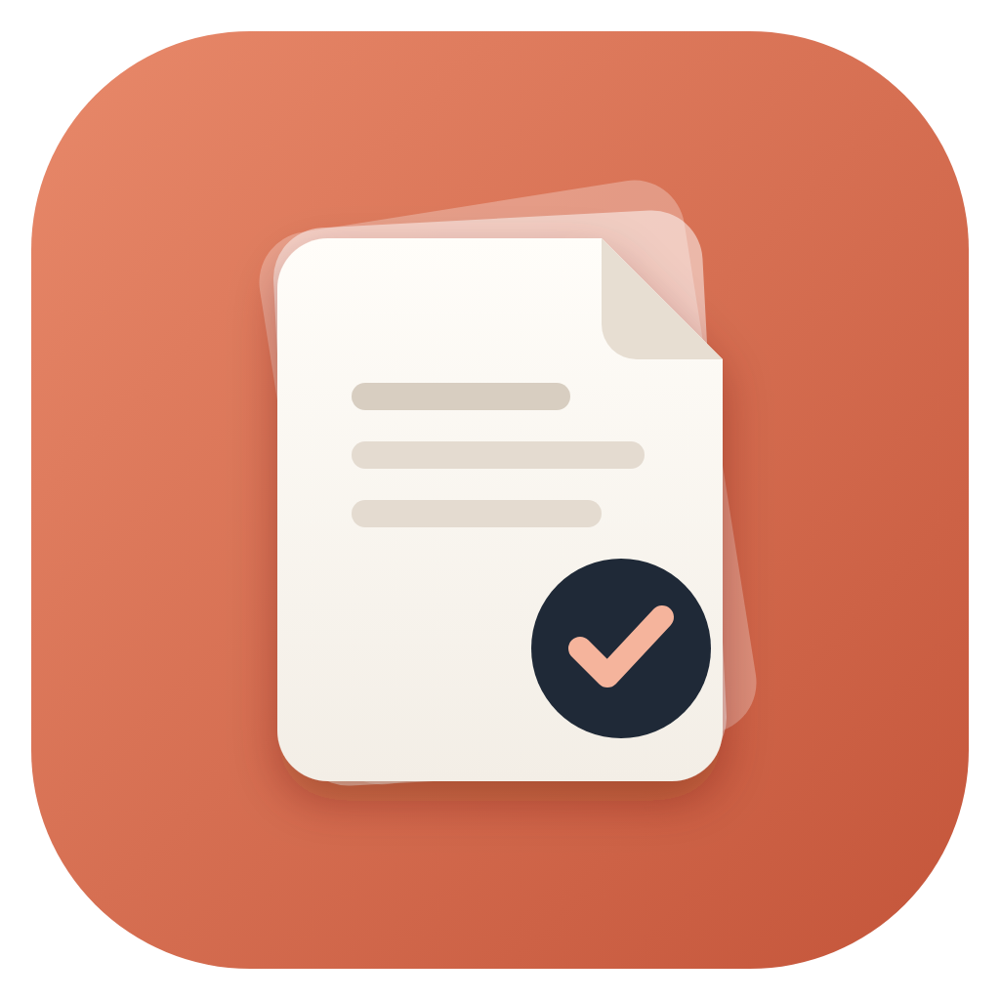
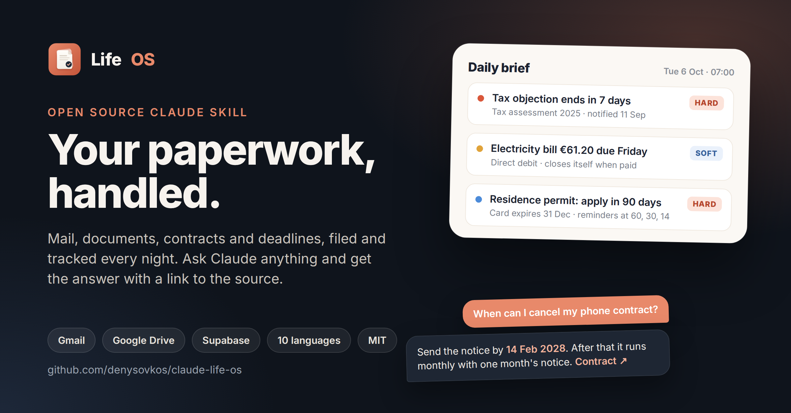

  

<h1 align="center">Life OS</h1>

  <b>Le tue pratiche, sistemate.</b> 
  Una skill open source per Claude su Gmail, Google Drive e Supabase

  

  
  
  
  
  

<a href="README.md">English</a> · <a href="README.uk.md">Українська</a> · <a href="README.de.md">Deutsch</a> · <a href="README.pl.md">Polski</a> · <a href="README.fr.md">Français</a> · <a href="README.es.md">Español</a> · <b>Italiano</b> · <a href="README.nl.md">Nederlands</a> · <a href="README.ru.md">Русский</a> · <a href="README.pt.md">Português</a>

  

Un sistema personale per le pratiche burocratiche. Legge Gmail e Google Drive, tiene un
indice di ogni documento ufficiale, lettera, contratto e bolletta in un database che è
tuo, e fa sì che nessuna scadenza, rinnovo automatico o data di validità ti sfugga. Gli
fai domande in linguaggio normale, in qualsiasi chat di Claude: «quando scade il mio
passaporto», «posso ancora disdire la palestra», «cosa dice il contratto d'affitto sugli
animali».

L'ha costruito una persona per la propria vita, usandolo ogni giorno per un mese, e ora
sta diventando qualcosa che chiunque può installare. Non serve programmare: Claude ti
guida in ogni passaggio.

## Installazione

Questo vale per Claude normale: claude.ai nel browser, oppure l'app Claude su computer o
telefono.

**1. Scarica la skill: [life-os.zip](https://github.com/denysovkos/claude-life-os/releases/latest/download/life-os.zip)** (non estrarla). È un'unica skill che
contiene tutto: installazione, posta, file, controllo notturno, revisione mensile e le
risposte alle tue domande. Il link punta sempre all'ultima versione
([tutte le release](https://github.com/denysovkos/claude-life-os/releases)).

**2. Aggiungila a Claude.** In Claude apri **Settings** → **Capabilities**, attiva
**Code execution and file creation** (alle skill serve), poi sotto **Skills** clicca
**Upload skill** e scegli `life-os.zip`.

**3. Collega i tuoi account.** **Settings** → **Connectors**: Google Drive, Gmail e
Supabase; se vuoi anche Google Calendar, Todoist, Craft.

**4. Apri una nuova chat e scrivi: `set up life os`.** Da qui guida Claude. Fa alcune
domande (lingua, paese, quali app usi), crea il database e le cartelle su Drive, e
controlla ogni passaggio prima del successivo.

**5. Installa il ponte Google Apps Script** quando Claude te lo chiede. È un file che gira
nel tuo account Google ogni 15 minuti, anche quando Claude non è attivo (nomi dei
pulsanti in inglese; Google può mostrarli in italiano):

- script.google.com → **New project** → incolla il codice che ti mostra Claude → salva;
- **Project Settings** → **Script Properties** → aggiungi `SUPABASE_URL` e
  `SUPABASE_SECRET_KEY` (Claude ti dice dove trovarli; la chiave va solo lì, mai in una
  chat);
- scegli la funzione `install` → **Run** → **Review permissions** → il tuo account →
  «Google hasn't verified this app» → **Advanced** → **Go to Life OS bridge (unsafe)** →
  **Select all** → **Allow**. L'avviso è normale: è il tuo script e gira solo nel tuo
  account.

Passo passo, con la spiegazione di ogni autorizzazione (in inglese):
[docs/apps-script.md](docs/apps-script.md).

**6. Lasciala girare ogni notte.** Claude non parte da solo, quindi crea quattro
esecuzioni pianificate, meglio di notte e in quest'ordine: posta alle **01:05**, file
alle **02:05**, il controllo notturno con il riepilogo quotidiano alle **03:05** e la
revisione mensile il giorno 1 alle **04:05**. Prima la posta, perché la sua
classificazione dice al ponte quali allegati copiare; i file un'ora dopo li indicizzano
la stessa notte; il controllo per ultimo, così il riepilogo del mattino contiene tutto.
Creale come attività pianificate in Claude, ognuna con il prompt di
[docs/scheduling.md](docs/scheduling.md) (in inglese).

È tutto, circa 30 minuti. In seguito, in qualsiasi momento, scrivi **`life os doctor`**:
controlla tutto il sistema e ti dice esattamente cosa sistemare.

**Aggiornare:** scarica il nuovo `life-os.zip` e caricalo allo stesso modo (se Claude non
sostituisce la skill, elimina prima quella vecchia). Poi scrivi `life os doctor`: applica
da solo gli aggiornamenti del database e le nuove regole.

### Cosa ti serve

- Un account Google (Gmail e Google Drive).
- Un piano Claude con skill e connettori.
- Un account [Supabase](https://supabase.com) gratuito. Supabase è il database che
  contiene l'indice; il piano gratuito basta. Il progetto lo crea Claude.
- Facoltativi: Todoist per le attività, Craft per il report mensile. Senza, attività e
  report arrivano via e-mail e come Google Docs.

## Cosa fa per te

- **Ogni notte** legge la posta nuova, la divide in 10 categorie (bollette, enti
  pubblici, banca, contratti, viaggi e così via), estrae importi e scadenze di pagamento,
  e crea un'attività quando devi fare qualcosa. Viaggi e appuntamenti diventano eventi in
  calendario.
- **Gli allegati importanti** (bollette, contratti, lettere degli enti) vengono copiati
  automaticamente su Google Drive, archiviati nella cartella giusta e indicizzati con il
  testo completo.
- **Segue le scadenze, non solo le date.** Un permesso di soggiorno che scade; un
  provvedimento impugnabile entro un mese; un'assicurazione che si rinnova da sola se non
  la disdici tre mesi prima: ognuno diventa una scadenza con promemoria sempre più
  frequenti. Il modo di calcolarla dipende dal tuo paese.
- **Un breve riepilogo quotidiano**, solo nei giorni in cui qualcosa conta. Mai un «tutto
  a posto».
- **Una revisione mensile**: quanto paghi ogni mese, cosa è cambiato, cosa puoi disdire e
  entro quando, cosa va nella dichiarazione dei redditi e cosa sembra strano.
- **Una cartella di emergenza**: un Google Doc riscritto ogni giorno con le pratiche
  aperte, scadenze, contratti, assicurazioni, dove sono gli originali e chi chiamare.

## Attività nel tuo task manager

La lista la tiene il database; il task manager si limita a rispecchiarla, quindi non si
perde nulla se cambi app o non ne usi nessuna. Con Todoist ricevi:

| Attività | Quando |
|---|---|
| `📅 Daily brief <data>: <la cosa più importante>` | solo nei giorni in cui qualcosa conta; il riepilogo è nella descrizione |
| `💌 <categoria> <mittente>: <cosa fare>` | una lettera richiede un'azione |
| `⚠️ <documento> expires <data>: <file>` | un documento scade entro 30 giorni |
| `🧾 Review <mese>: <decisione principale>` | una volta al mese, le decisioni che puoi prendere solo tu |
| `⚠️ <processo> failed <data>` | un'esecuzione notturna ha avuto errori |

I titoli sono nella lingua che scegli; le parole `Daily brief` restano in inglese perché
così il sistema riconosce il proprio riepilogo. Completare un'attività chiude la scadenza
che c'è dietro. Altro in [docs/tasks.md](docs/tasks.md) (in inglese).

## Impostazioni

Tutte le impostazioni stanno in una tabella del tuo database, `life_settings`, e ogni
modifica viene registrata in `settings_history`, visibile e annullabile. Per cambiare
qualcosa basta dirlo: «imposta la lingua su inglese», «mi sono trasferito in Germania»,
«aggiungi mia sorella alla cartella di emergenza». Quando cambiano il tuo paese o le sue
regole, le scadenze già calcolate vengono ricalcolate, dopo che Claude ti ha mostrato
cosa si sposta. Dettagli in [docs/settings.md](docs/settings.md) (in inglese).

## Lingue e paesi

Il sistema legge la posta in qualsiasi lingua. I suoi testi (riepiloghi, attività,
report, cartella di emergenza, nomi delle cartelle) sono disponibili in queste lingue:

| Lingua | Stato |
|---|---|
| English, Deutsch, Українська | complete e testate |
| Polski, Français, Español, Italiano, Nederlands, Русский, Português | traduzione iniziale, inglese dove manca |

Le regole legali (come si calcola un termine di ricorso, quando si può disdire un
contratto, entro quando restituire un acquisto, quando presentare la dichiarazione)
arrivano con un **pacchetto regionale**:

| Paese | Stato |
|---|---|
| 🇩🇪 Germania | completo e testato |
| 🇦🇹 🇫🇷 🇪🇸 🇮🇹 🇳🇱 🇵🇹 🇵🇱 🇬🇧 🇺🇸 🇺🇦 Austria, Francia, Spagna, Italia, Paesi Bassi, Portogallo, Polonia, Regno Unito, Stati Uniti, Ucraina | beta: scritto a partire dalle leggi citate in ogni regola, non ancora verificato sul posto |

Altrove il sistema segue comunque ogni data che legge, ma usa valori prudenti e ti chiede
le regole locali. Correzioni ai pacchetti beta o un nuovo paese sono benvenuti:
[packs/README.md](packs/README.md).

## Privacy e sicurezza

I tuoi dati restano nei tuoi account: il tuo Gmail, il tuo Drive, il tuo progetto
Supabase. Non c'è nessun server in mezzo e nessun altro ha accesso. Il database è chiuso
in modo che la sua interfaccia pubblica non restituisca nulla; possono leggerlo solo
Claude (tramite il tuo connettore) e il tuo Apps Script. I file non passano mai
dall'IA: Google li sposta direttamente da Gmail a Drive. Dettagli in
[docs/security.md](docs/security.md) (in inglese).

## Come funziona

Tutto ciò che deve succedere in tempo lo fanno cose che non dimenticano: Google Apps
Script ogni 15 minuti e processi pianificati nel database ogni notte. Claude fa solo ciò
che richiede giudizio: leggere una lettera e capire cosa significa. Il database è l'unica
fonte di verità; Todoist, Craft e il calendario si limitano a rispecchiarlo.

- [docs/architecture.md](docs/architecture.md): componenti, modello dati, il percorso di una lettera.
- [docs/apps-script.md](docs/apps-script.md): installare il ponte.
- [docs/scheduling.md](docs/scheduling.md): la pianificazione notturna: orari, ordine.
- [docs/tasks.md](docs/tasks.md): cosa arriva nel task manager e come si chiude.
- [docs/settings.md](docs/settings.md): tutte le impostazioni e cosa succede quando una cambia.
- [docs/security.md](docs/security.md): chiavi, permessi, cosa vede l'IA, backup.
- [docs/troubleshooting.md](docs/troubleshooting.md): ogni guasto dell'originale e come si risolve.

## Stato

Versione iniziale. Database, ponte e lettura della posta hanno girato ogni giorno per un
mese nella versione privata originale e poi sono stati generalizzati. La skill di
installazione e i pacchetti sono nuovi. Aspettati qualche asperità e segnalala.
